# Qwiklabs Assessment: Managing Services in Windows


# Learning tip:

During this lab, we will show how to do certain tasks using graphical tools as well as using the command line with PowerShell. While you can copy and paste the commands that are presented throughout the lab, we recommend typing them out manually, to help with understanding and remembering these commands.

# List system services
First, we will connect to the <b>Services</b> application that is provided by Windows as an administrative tool. In order to open this application, you can either open the <b>Control Panel</b>, click on <b>System and Security</b>, then on <b>Administrative Tools</b> and finally on <b>Services</b>; or you can type "Services" into the Windows menu.

Once you open the application, make sure you make the columns wider so that you can see the actual descriptions of the services that are available in the system. You can click on one of the columns to change the order and, for example, see all services that have <b>Running</b> as their <b><em>Status</em></b> together.

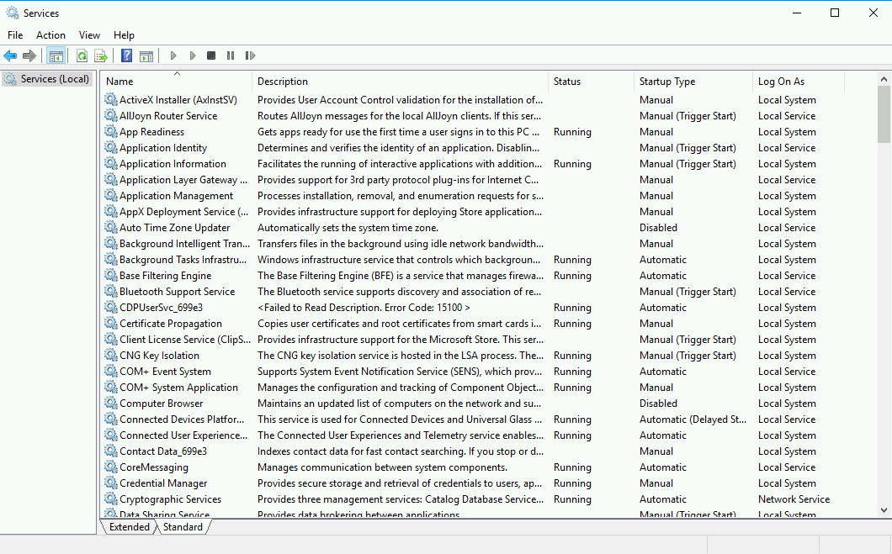

From this application, you can start and stop services that are running in the system. 

<b>Caution</b>: keep in mind that some of the services that are running may be critical to ensure that you stay connected to the machine. Pay attention to what the services do before you try stopping them.

When you right-click on the line that shows a service, you get a menu of action options. The menu shows all actions, but the ones that are not currently available are grayed out. So, if the service is running, <b>Start</b> will be grayed out. If the service is not running, <b>Stop</b> will be grayed out.

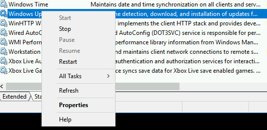

You can also access the <b>Properties</b> menu, where you will see other data and configuration about the service. For example, in the <b>Recovery</b> tab, it will indicate what's the configured behavior in case of a service failing.

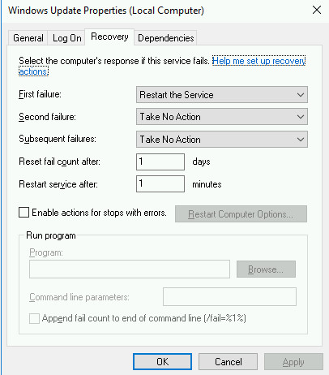

# Stopping and starting services

Let's look at the <b>Themes</b> service. This service is in charge of managing the graphical themes applied to the machine. It's also in charge of managing certain features related to the video card. While you wouldn't want to stop it on your local physical machine as it might cause problems with your graphical interface, it's fine to stop it for the purposes of this lab as it's a virtual machine with a virtualized video card.

So, go ahead and right-click on the <b>Themes</b> line and then click <b>Stop</b> in the pop-up menu. A window will appear showing the progress of stopping the service and once it's gone, the service will be stopped.

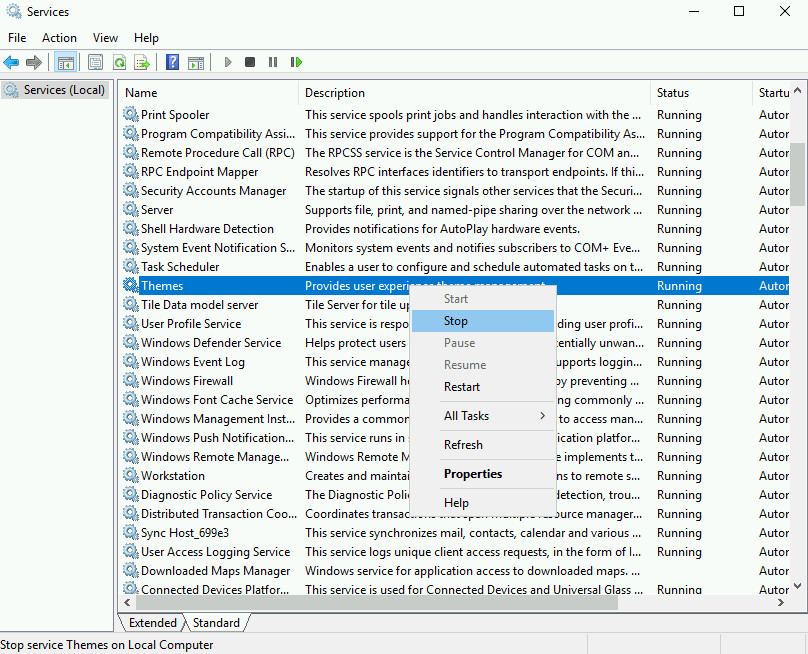

Let's now look at the <b>Performance Logs & Alerts</b>service. This service is not running by default. It can be used to collect logs related to the performance of the machine and to setup alerts that will trigger when certain thresholds are passed. The data collected by this service can be configured and visualized in the <b>Server Manager</b>application.

Let's now start this service: right-click on the <b>Performance Logs & Alerts</b>line and then click <b>Start</b> in the pop-up menu. A similar window as before will appear, showing the progress and once it's gone, the service will be started.

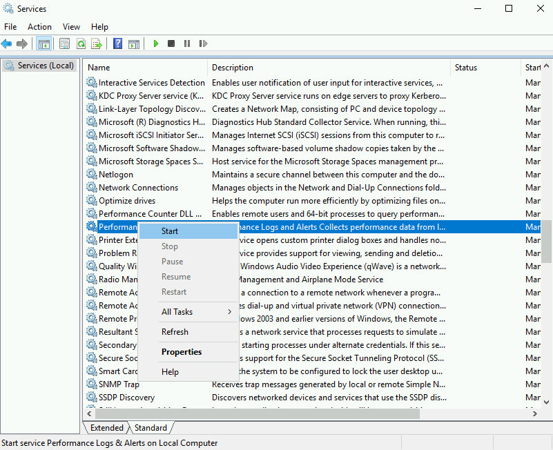

Many of these services can also be started or stopped through other tools in the system. For example, the service called Auto Time Zone Updater is used to set the timezone of the running system from the data obtained through the network. This service can be enabled from the Service console, but it can also be enabled from the Date and Time settings.

If you look at the Auto Time Zone Updater service now, it's disabled. Let's enable it through the Date and Time settings window.

If you left click on the clock shown in the lower right corner, you'll get a pop-up with the time, date, calendar and a link to Date and Time settings.

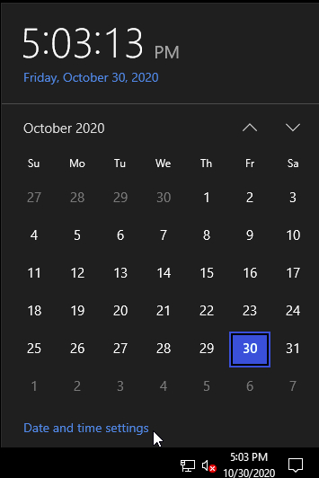

If you click on that link, the settings window for all configuration related to the date and time will appear, including the Set time zone automatically setting. This setting is directly related to the Auto Time Zone Updater service. Click on the slider to enable the setting, go back to the Services application, click Refresh in the right-click menu, and you'll see that the service is now enabled.

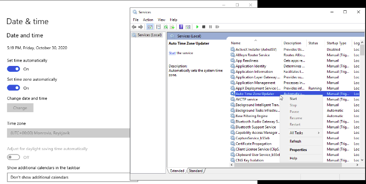

## Interacting with services through PowerShell
While as a user it's common to use Graphical User Interfaces (or GUIs) to interact with the system, as a system administrator you will usually want to automate the tasks that you do, and for that you will be using the command line.

Let's see how to perform these same tasks through the command line. Go ahead and open the Windows PowerShell application, by clicking on the Start menu and then selecting it from the list of applications.

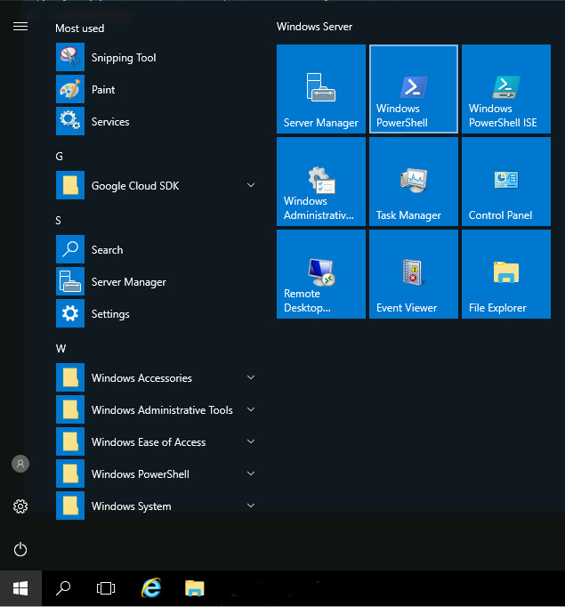

In this shell, we can use the Get-Service command to list all the available services.

```
Get-Service
```
OUTPUT: 

```
Status   Name               DisplayName
------   ----               -----------
Stopped  VSS                Volume Shadow Copy
Running  w32time            Windows Time
Stopped  WaaSMedicSvc       Windows Update Medic Service
Stopped  WalletService      WalletService
Stopped  WarpJITSvc         WarpJITSvc
Stopped  WbioSrvc           Windows Biometric Service
Running  Wcmsvc             Windows Connection Manager
Stopped  WdiServiceHost     Diagnostic Service Host
Stopped  WdiSystemHost      Diagnostic System Host
Running  WdNisSvc           Windows Defender Antivirus Network ...
Stopped  Wecsvc             Windows Event Collector
Stopped  WEPHOSTSVC         Windows Encryption Provider Host Se...
Stopped  wercplsupport      Problem Reports and Solutions Contr...
Stopped  WerSvc             Windows Error Reporting Service
Stopped  WiaRpc             Still Image Acquisition Events
Running  WinDefend          Windows Defender Antivirus Service
Running  WinHttpAutoProx... WinHTTP Web Proxy Auto-Discovery Se...
Running  Winmgmt            Windows Management Instrumentation
Running  WinRM              Windows Remote Management (WS-Manag...
Stopped  wisvc              Windows Insider Service
Stopped  wlidsvc            Microsoft Account Sign-in Assistant
Stopped  wmiApSrv           WMI Performance Adapter
Stopped  WMPNetworkSvc      Windows Media Player Network Sharin...
Stopped  WPDBusEnum         Portable Device Enumerator Service
Running  WpnService         Windows Push Notifications System S...
Running  WpnUserService_... Windows Push Notifications User Ser...
Stopped  WSearch            Windows Search
Stopped  wuauserv           Windows Update
```

This is a long list. You can scroll up using PgUp/PgDown, or with the mouse wheel. This list includes the Status of the service, the Name and the DisplayName. The Name is short and is the one used to get information of a specific service, the DisplayName is a more descriptive and longer name.

For example, we can get information of the wisvc service:

```
Get-Service wisvc
```

OUTPUT:

```
Status   Name               DisplayName
------   ----               -----------
Stopped  wisvc              Windows Insider Service
```

This tells us that wisvc is the short name of the Windows Insider Service. This service allows you to test out the latest OS builds and Apps from Microsoft. We can get more information for the service, using the Format-List command.

```
Get-Service wisvc | Format-List *
```

OUTPUT:
```
Name                : wisvc
RequiredServices    : {rpcss}
CanPauseAndContinue : False
CanShutdown         : False
CanStop             : False
DisplayName         : Windows Insider Service
DependentServices   : {}
MachineName         : .
ServiceName         : wisvc
ServicesDependedOn  : {rpcss}
ServiceHandle       : SafeServiceHandle
Status              : Stopped
ServiceType         : Win32ShareProcess
StartType           : Manual
Site                :
Container           :
```

Stopping and starting services
Now, we can start the Windows Insider Service, using the Start-Service command:

```
Start-Service wisvc
```

This command doesn't give any output. To verify that it worked, let's get the status again, using Get-Service:

```
Get-Service wisvc
```

OUTPUT:

```
Status   Name               DisplayName
------   ----               -----------
Running  wisvc              Windows Insider Service
```

The service is now started. But this is an important service, we don't want it to stay started; let's stop it using the Stop-Service command.

```
Stop-Service wisvc
```

Again, this doesn't give any output if it succeeds, let's use Get-Service to see if it worked.

```
Get-Service wisvc
```

Yes, it's stopped again.

Enabling services
We can stop and start any services that are already enabled in the system, but not services that are disabled. Let's look at one example of a service that is currently disabled. We will use the ScardSvr or Smart Card service. This service is used to read smart cards and it's currently disabled because it's not needed. We can see that it's disabled, by using the Get-Service plus Format-List commands:

```
Get-Service ScardSvr | Format-List *
```

OUTPUT:

```
Name                : ScardSvr
RequiredServices    : {}
CanPauseAndContinue : False
CanShutdown         : False
CanStop             : False
DisplayName         : Smart Card
DependentServices   : {}
MachineName         : .
ServiceName         : ScardSvr
ServicesDependedOn  : {}
ServiceHandle       :
Status              : Stopped
ServiceType         : Win32ShareProcess
StartType           : Disabled
Site                :
Container           :
```


The StartType field says that this service is Disabled. This means that it can't be started until it's enabled. Let's see what happens if we try to start it anyway:

```
Start-Service ScardSvr
```

OUTPUT:

```
Start-Service : Service 'Smart Card (ScardSvr)' cannot be started due to the 
following error: Cannot start service
ScardSvr on computer '.'.
At line:1 char:1
+ Start-Service ScardSvr
+ ~~~~~~~~~~~~~~~~~~~~~~
    + CategoryInfo          : OpenError: 
(System.ServiceProcess.ServiceController:ServiceController) [Start-Service],
   ServiceCommandException
    + FullyQualifiedErrorId : 
CouldNotStartService,Microsoft.PowerShell.Commands.StartServiceCommand
```

Instead of the usual empty output, we get an error message. The error says that the service couldn't be started. To change that, we will use the Set-Service command, which allows us to modify some of the properties of the service.

```
Set-Service ScardSvr -StartupType Manual
```
This won't generate any output, but if we now try to start the service, it will succeed.

```
Start-Service ScardSvr
```
This time we got no output, which means that there were no errors. Let's check the status one last time:

```
Get-Service ScardSvr
```
OUTPUT
```
Status   Name               DisplayName
------   ----               -----------
Running  ScardSvr           Smart Card
```

Well done! We have enabled and started the service.

Enabling additional features
There are a number of features that are available in a Windows system that are not enabled by default. This is so that the system administrator only has to manage the features that are actually in use, instead of all the possible features out there.

We can use the Install-WindowsFeature command to enable these features. For example, let's run this command to enable the few more web serving features in the system:

```
Install-WindowsFeature Web-WebServer,Web-Mgmt-Tools -IncludeAllSubFeature
```
OUTPUT:

```
Collecting data...
    10%
    [0000000000000                                                   ]
```

Be patient, this will take a few minutes to run, as it's downloading additional components and then installing them on the system. You will see a progress bar on the console, although not necessarily at the cursor.

When the progress bar disappears, it should tell you that it succeeded in installing the service which is now running.

OUTPUT:

```
Success Restart Needed Exit Code      Feature Result
------- -------------- ---------      --------------
True    No             Success        {.NET Framework 3.5 (includes .NET 2.0 and...
```

There are a number of new services that were added when enabling this feature. For example, IISADMIN is the service used to publish websites on the machine.

```
Get-Service IISADMIN
```

OUTPUT

```
Status   Name               DisplayName
------   ----               -----------
Running  IISADMIN           IIS Admin Service
```

With this service running, you'll be able to use the web serving functionality on the machine.

Serving web pages
Let's configure our newly installed web server to serve our own website. In order to do this, you'll need to open the Internet Information Services (IIS) Manager program. To do that, type IIS into the Windows menu.

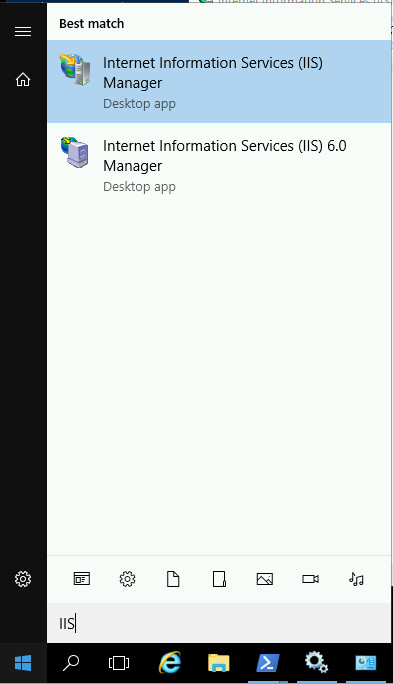

Once the application opens, expand the QWIKLABS-BB-XXX option, and click on the Sites option. This shows a list of available sites, currently only showing the Default Website.

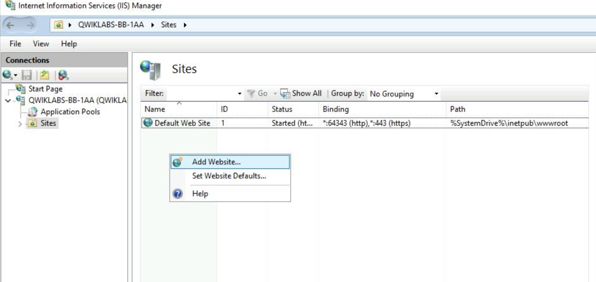

Let's add a new site, by right-clicking on the list and selecting Add Website. This will pop up a window with some fields that need to be filled in. Naming the site enables you to identify it from others. You can call it whatever you want. The physical path of the website is the location where the files are located in the computer. In this case, the files are located in C:\Users\qwiklabs\amazingsite, so select that folder as the path.

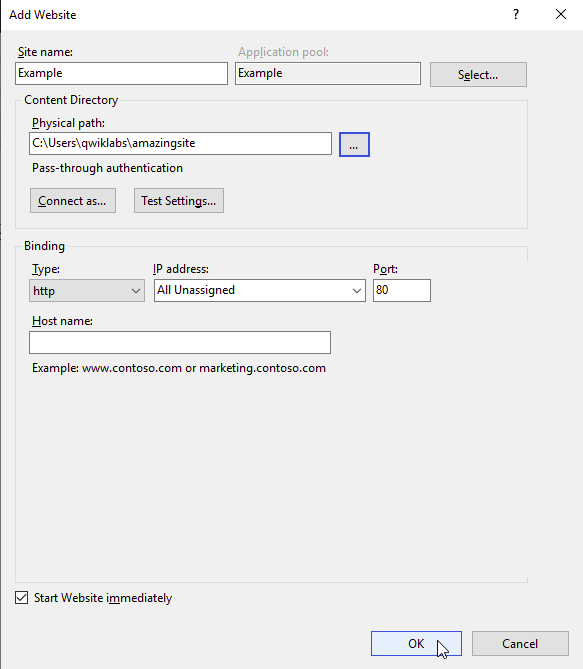

Click OK after filling all the provided details, then you will see that your website was created and running on port 80. Now you can verify the new website by pointing your browser to the External IP address shown in the Connection Details Panel.


Woohoo!

Conclusion
Congratulations! You've successfully listed all the services that are available on the machine, practiced stopping and starting some of these services, and checked their status. You also configured the machine to serve web pages by enabling an additional system feature, and then customized this to serve a different website.

These are important skills that are essential to your future work as a system administrator. Keep it up!
